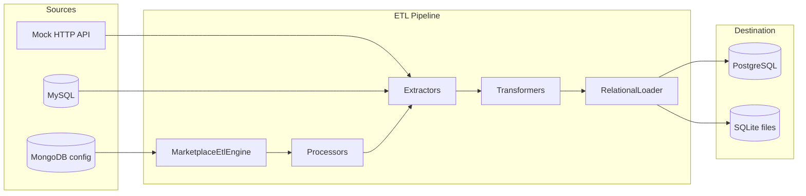

# Architecture Overview

## High-level shape

The repo is a **uv workspace monorepo** with three members:

```
packages/etl/          All-purpose async ETL framework (no domain, no DB drivers)
apps/etl-usage-example/    Marketplace domain: entities, processors, adapters
services/external-api-example/   API to mock source data, in this case orders and traffic
```



## Architectural decisions

### Hexagonal / ports and adapters

**Inbound ports** (what the pipeline needs from the outside):

- `OrderSourceClient`, `TrafficSourceClient`, `ProductDbReader` — extraction
- `ConfigStore`, `SyncStateStore` — tenant config and cursors
- `LoaderFactory` — creates backend-specific loaders

**Outbound adapters** (concrete implementations):

- `MockSourceApiClient`, `MysqlProductDbReader`, `MongoConfigStore`
- `PostgresLoaderFactory` / `SqliteLoaderFactory` with dialect-specific `RecordWriter`

Processors depend on **protocols**, not concrete classes. Wiring happens in `main.py`.

### Framework vs application split

`etl` owns reusable abstractions:

- `BaseExtractor`, `BaseTransformer`, `BaseLoader`, `BaseProcessor`, `BaseEngine`
- `RelationalLoader` — dedup, sync-date bookkeeping, delegates writes to `RecordWriter`
- Date/period chunking, logging decorators, concurrency helpers

`etl-usage-example` owns everything marketplace-specific: models, transformers, processor configs, adapter implementations.

**Import-linter** enforces `etl` must not import `my_marketplace_etl`.

### Backend-agnostic loading

Load logic follows a two-layer pattern:

1. **`RelationalLoader`** (core) — domain-agnostic: dedup, sync dates, calls `RecordWriter`
2. **Backend adapters** (app) — Postgres or SQLite each own upsert SQL, connection pooling, and custom update routines

Dialect-specific SQL (`build_upsert_query`) lives in the adapter, not the framework.

### Multi-tenancy

Each seller gets its own destination database (Postgres DB name or SQLite file). The engine is instantiated **per seller**; sellers run concurrently up to `MAX_RUNNER_EXECUTIONS`.

Sync dates are stored per seller per entity in MongoDB, enabling first/incremental/all sync modes.

### Batch orchestration model

An engine configures one processor per entity (`order`, `product`, `traffic`). Each processor:

1. Extracts data in date-range chunks
2. Transforms to destination schema (pandas in the middle)
3. Loads via `LoaderFactory`-created loaders

Processors for related entities (e.g. order + order_payment) share a single extraction pass via `EtlProcessorEntity` batching in `BaseProcessor`.

## How it fits an existing ecosystem

| Concern | This project | Typical production complement |
|---------|--------------|----------------------------|
| Scheduling | Manual / Docker Compose one-shot | Airflow, Prefect, cron, K8s Jobs |
| Orchestration UI | None | Dagster, Airflow UI |
| Data warehouse | Per-seller Postgres/SQLite | Snowflake, BigQuery, Redshift |
| Config store | MongoDB | Consul, feature flags, app DB |
| Observability | Structured log summary to stdout | OpenTelemetry, Datadog, structured logging sink |
| Schema registry | SQLAlchemy models + SQL migrations | Avro/Protobuf, dbt |

The value is the **internal structure** — how to isolate sources, destinations, and sync state — not the operational wrapper.

## Trade-offs addressed

| Trade-off | Choice | Rationale |
|-----------|--------|-----------|
| Flexibility vs simplicity | Protocols + manual DI in `main.py` | Easy to read and swap; no framework magic |
| Shared vs per-tenant DB | Per-seller destination DB | Isolation, simpler upserts, matches SaaS analytics |
| ORM vs raw SQL for writes | SQLAlchemy for metadata, raw SQL for upserts | Full control over `ON CONFLICT` behavior and bind-parameter batching |
| Monolith vs monorepo | Monorepo with strict package boundary | One repo to clone; `etl` reusable across future apps |
| Test speed vs fidelity | Mock HTTP + SQLite option | Unit tests without Docker; e2e with full stack |

## Limitations

- **No scheduler** — you trigger runs explicitly; no retry queue or dead-letter handling beyond in-loader backoff
- **MongoDB is hardcoded** for config/sync state — no in-memory or alternate config adapter shipped
- **MySQL product source is concrete** — only `ProductDbReader` is abstracted; no SQLite/file source variant
- **Manual composition root** — `main.py` wires concrete classes; no DI container or env-driven adapter registry
- **Custom update routines are duplicated** across Postgres and SQLite adapters
- **SQLAlchemy models used for metadata only** — migrations are hand-written SQL files, not Alembic-autogenerated
- **Date-based incremental sync** — no change-data-capture, idempotency keys, or late-arriving data handling beyond upserts
- **Single-process concurrency** — asyncio parallel sellers, not distributed workers
- **Docker e2e assumes Postgres** — SQLite path skips the Postgres wait but still needs Mongo, MySQL, and the mock API for a full run
